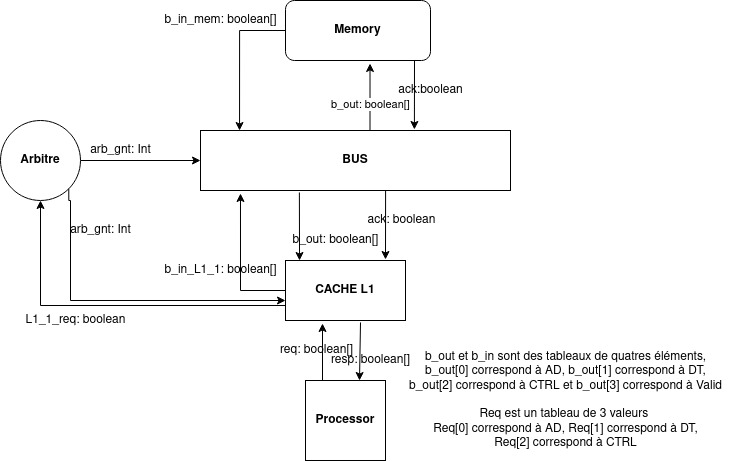
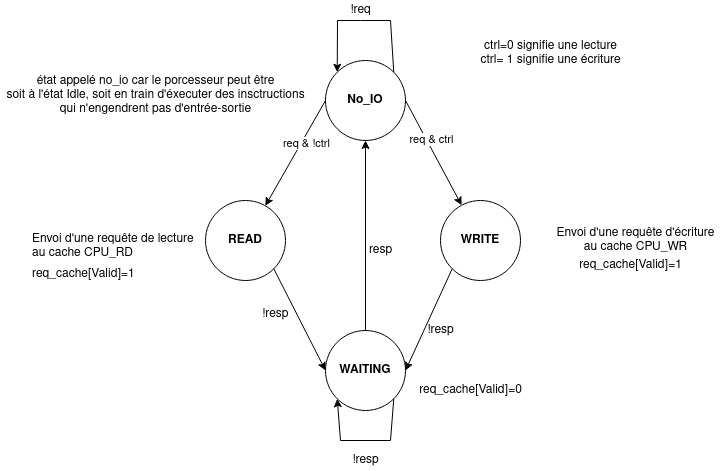

## Modélisation
### Définition des signaux d'interface des éléments de la plateforme, des interactions entre composants et de la nature des données à transférer

### Automate de chaque composant
#### Bus

#### Arbitre

#### Mémoire

#### Cache L1 
simplification hypothesis: the cache only transmits the queries

#### Processeur
In the code modelisation, I consider that the states WRITE and READ can be combined into one state

### Snoop